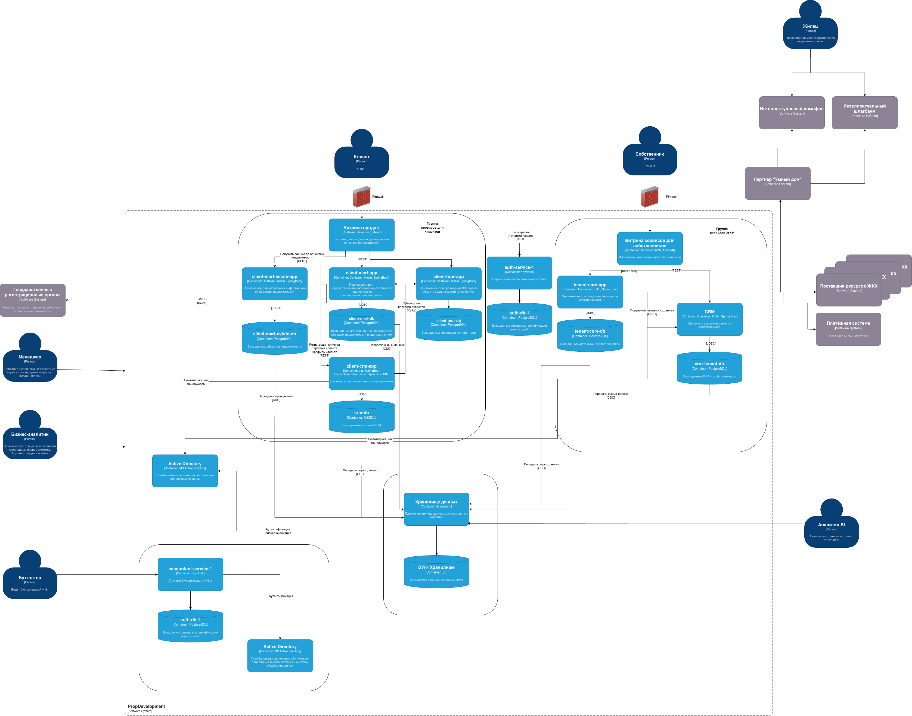

### Диаграмма контекста в модели С4. Отражает контекст, в котором будут работать новые бизнес-функции

### Доработанная диаграмма контейнеров

### Список требований, которым должны удовлетворить внешние интеграции

- Внешние интеграции не должны запрашивать персональную информацию клиентов
- Внешние инетграции должны находится на территории РФ, чтобы удовлетворять требования по передаче информации о пользователях
- Внешние интеграции должны получать и передавать данные только по защищенному соединению
