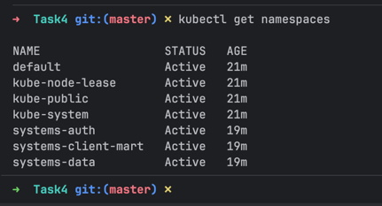
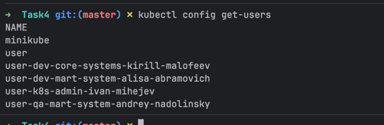
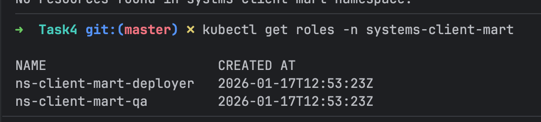
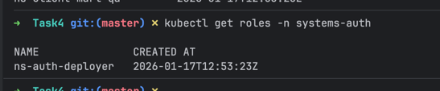
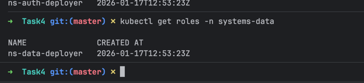
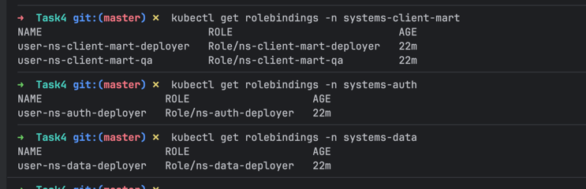

### Summaary

Спроектированные роли:[Роли K8s.md](%D0%A0%D0%BE%D0%BB%D0%B8%20K8s.md)

Ниже описаны скрипты для создания пользователей и ролей.
Скрипты создают только некоторые из ролей, которые были описаны в файле со спроектированными ролями


### Требования

Проверить что установлен:
- kubectl
- openssl

### Создать пользователей, и назначить права

```bash
./create-users.sh
./create-namespaces.sh
./create-roles.sh
./create-role-bindings.sh
```

### Что происходит:

#### Создагы namespaces:

- `systems-auth`
- `systems-data`
- `systems-client-mart`



#### Созданы пользователи:

- user-k8s-admin-ivan-mihejev - администратор k8s
- user-dev-mart-system-alisa-abramovich - разработчик витрины
- user-dev-core-systems-kirill-malofeev - разработчик core команды (авторизация и общее хранилище)
- user-qa-mart-system-andrey-nadolinsky - QA команды витрины




#### Созданы роли:








#### Роли связаны с пользователями

