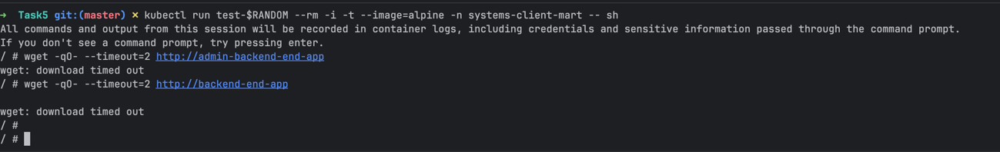
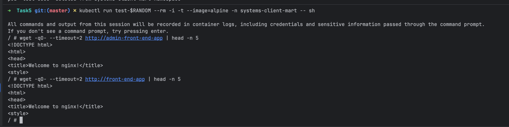
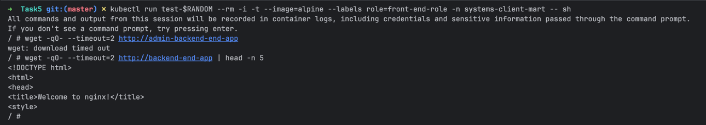
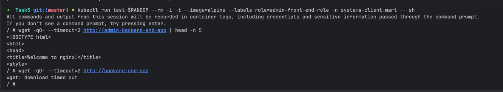

Сетевые политики находятся в директории [network-policies](network-policies)

### Ход выполнения работы и валидация корректности работы

#### 1. Назначение меток приложениям

Условия:
- должны быть созданы namespaces из задания 4 [create-namespaces.sh](../Task4/create-namespaces.sh)
- Перейти в директорию `Task 5`
- Убедиться что minikube запущен с `cni=calico`, например `minikube start --cni=calico`

```bash
kubectl run front-end-app --image=nginx --labels role=front-end-role --expose --port 80 -n systems-client-mart
kubectl run backend-end-app --image=nginx --labels role=back-end-role --expose --port 80 -n systems-client-mart

kubectl run admin-front-end-app --image=nginx --labels role=admin-front-end-role --expose --port 80 -n systems-client-mart
kubectl run admin-backend-end-app --image=nginx --labels role=admin-back-end-role --expose --port 80 -n systems-client-mart
```

#### 2. Применение Network policies

```bash
kubectl apply -f network-policies/allow-admin-frontend-to-admin-backend.yaml
kubectl apply -f network-policies/allow-frontend-to-backend.yaml
```

#### 3. Проверка работоспособности

Запросы в бекенд приложения не работают из пода не относящегося к фронту

```bash
kubectl run test-$RANDOM --rm -i -t --image=alpine -n systems-client-mart -- sh
wget -qO- --timeout=2 http://admin-backend-end-app
wget -qO- --timeout=2 http://backend-end-app
```



Запросы в фронт-енд приложения работают с любого пода

```bash
kubectl run test-$RANDOM --rm -i -t --image=alpine -n systems-client-mart -- sh
wget -qO- --timeout=2 http://admin-front-end-app | head -n 5
wget -qO- --timeout=2 http://front-end-app | head -n 5
```



Запрос с фронт-енд работают только на бекенд (не админский)

```bash
kubectl run test-$RANDOM --rm -i -t --image=alpine --labels role=front-end-role -n systems-client-mart -- sh
wget -qO- --timeout=2 http://admin-backend-end-app
wget -qO- --timeout=2 http://backend-end-app | head -n 5
```



Запрос с админского фронта уходит только на админский бек

```bash
kubectl run test-$RANDOM --rm -i -t --image=alpine --labels role=admin-front-end-role -n systems-client-mart -- sh
wget -qO- --timeout=2 http://admin-backend-end-app | head -n 5
wget -qO- --timeout=2 http://backend-end-app
```



